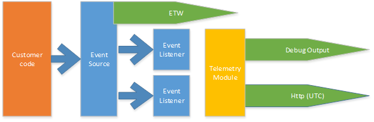

# Error logging

This document explains how Open Census SDK logs information about it's own
execution.

There are the following scenarios for SDK manageability:

1. Send error & warning logs to the back-end for customer self-troubleshooting.
2. Visualize OC SDK health in external tools.
3. Visualize OC SDK health in Z-Pages.
4. Show errors/warnings/information in Visual Studio F5 debug window.
5. Testing – no debugger troubleshooting.
6. Customer support – collect verbose logs.

## Subscribing to EventSource 

EventSource allows us to separate logic of tracing and delivering those traces
to different channels. Default ETW subscriber works out of the box. For all
other channels in-process subscribers can be used for data delivery.

## EventSource vs. using SDK itself

1. No support for `IsEnabled` when exporter/listener exists. It's important for
   verbose logging.
2. ETW channel is not supported.
3. In-process subscription/extensibility is not supported.
4. Logging should be more reliable then SDK itself.

## Minimizing logging performance impact

### Pass object references

Today EventSource requires to use primitive types like int or string in Write
method. This limitation requires to format complex types like Exception before
calling trace statement.

Since formatting happens before calling write method it will be called
unconditionally – whether listener enabled or not. We anticipate to have a big
number of verbose trace statement that will require string formatting. To
minimize performance hit proxy class will accept object references and make
sure tracing enabled before formatting these objects.

### Diagnostics events throttling

Throttling is required for the following scenarios:

- Minimize traffic we use to report problems to portal
- Make sure *.etl are not overloaded with similar errors

Having these two scenarios we need to implement throttling in proxy class
before calling EventSource.
